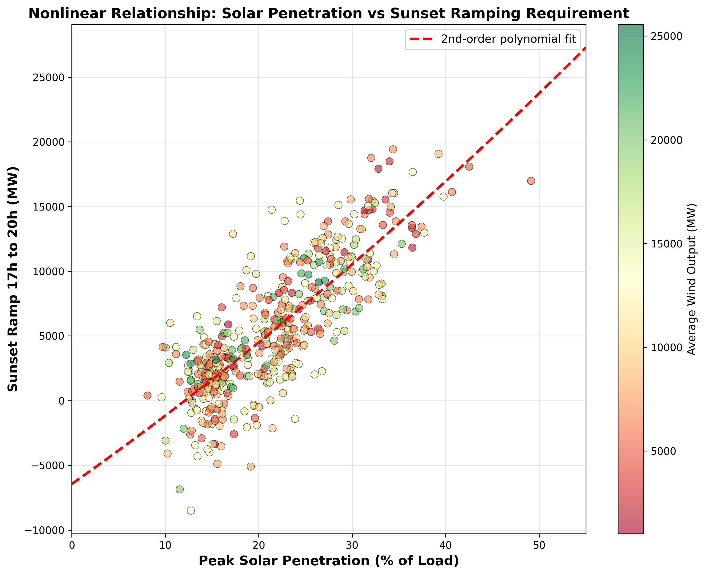
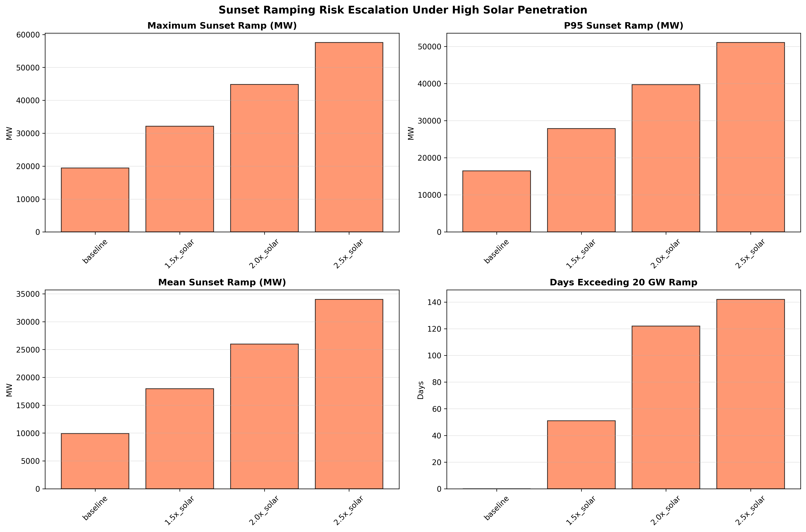
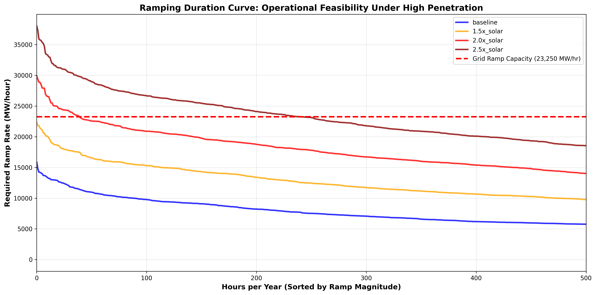
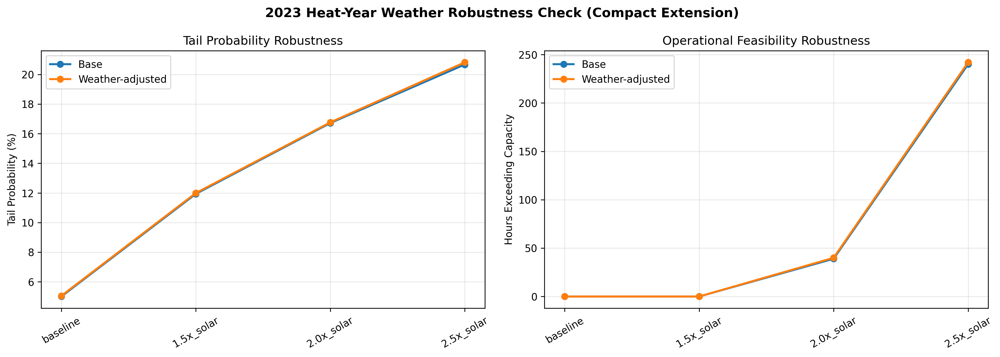
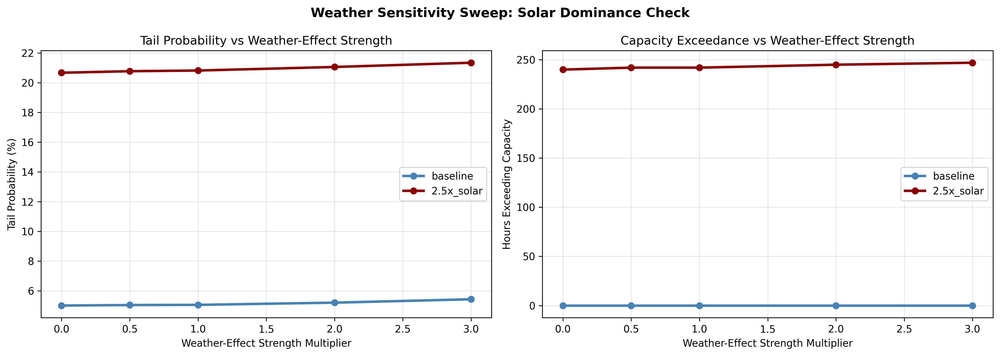

# Renewable Power Grid Risk

Independent research project by Kyle Lin, St. Mark's School of Texas, Class of 2028.  
Research start date: 2026-03-15.

## Project Overview

This repository studies how increasing renewable generation changes power-grid operating risk in ERCOT. The project reconstructs hourly net load from load, wind, and solar data, measures ramping risk, and tests renewable penetration scenarios to understand when higher wind and solar output can make grid operations more variable.

The central research question is:

> How does high renewable penetration affect net load variability, tail ramp risk, and the need for risk-aware grid mitigation?

The current research focus is Paper 1: **Quantifying Net Load Variability Under Increasing Renewable Penetration**.

## Research Goals

- Build a cleaned hourly ERCOT dataset from 2023-2025 load, wind, and solar data.
- Define net load as `ERCOT.LOAD - ERCOT.WIND.GEN - ERCOT.PVGR.GEN`.
- Quantify grid stress using ramp-rate and tail-risk metrics.
- Analyze seasonal and intraday ramp patterns, especially around sunset hours.
- Generate renewable penetration scenarios and sensitivity cases.
- Use the results as a foundation for later weather-uncertainty modeling and AI-guided storage mitigation.

## Key Results (Current)

The enhanced 2025 scenario analysis (baseline vs. 2.5x solar) shows a clear nonlinear increase in ramping stress:

- Max sunset ramp (17:00-20:00) increases from about 19,421 MW to 57,545 MW (about 3.0x).
- Tail probability rises from about 5.0% to about 20.7%.
- P99 1-hour ramp increases from about 10,003 MW to about 27,037 MW.
- Hours exceeding estimated dispatchable ramp capacity increase from 0 to 240 hours/year.

Interpretation: solar scaling is the first-order driver of tail ramp risk in this ERCOT setup, especially in the sunset transition window.

## Results Plots

### 1) Nonlinear Sunset Ramping vs Solar Penetration

This plot shows that sunset ramp requirements accelerate as daytime solar penetration rises.



### 2) Sunset Risk Escalation by Scenario

Across baseline, 1.5x, 2.0x, and 2.5x solar scenarios, both ramp magnitudes and high-risk day counts increase sharply.



### 3) Operational Feasibility (Ramping Duration Curve)

This compares required ramp rates against estimated dispatchable ramp capacity. Under high solar scenarios, the curve crosses the capacity line for many hours.



### 4) Weather Robustness Check (2023 Heat-Year Perturbation)

Weather-adjusted load moves risk metrics modestly relative to solar scaling. The core nonlinear conclusion remains stable.



### 5) Weather-Effect Strength Dominance Sweep

Even when weather-load effect strength is amplified (up to 3.0x), the weather contribution remains much smaller than the baseline-to-high-solar jump.



## Methodology

1. **Data construction**
   - Read ERCOT hourly wind and solar Excel files for 2023-2025.
   - Merge load, wind generation, solar generation, installed capacity, and time features.
   - Create renewable output, renewable share, and net load fields.

2. **Risk quantification**
   - Compute 1-hour and 3-hour net-load ramps.
   - Define extreme events using a 95th percentile ramp threshold.
   - Measure maximum ramp, tail probability, conditional tail severity, percentile ramps, and ramp variance.

3. **Scenario analysis**
   - Create 2025 multiplier scenarios for solar and wind generation.
   - Run sensitivity analysis across solar and wind multipliers.
   - Compare ramp variance and tail-risk metrics across renewable penetration levels.

4. **Future extensions**
   - Incorporate NOAA weather station data into renewable uncertainty modeling.
   - Develop Monte Carlo weather scenarios.
   - Explore machine-learning risk detection and storage dispatch mitigation.

## Risk Metrics

The main reusable metric function is in `src/metrics.py`.

| Metric | Purpose |
| --- | --- |
| `max_ramp_up` | Largest positive 1-hour net-load increase |
| `max_ramp_down` | Largest negative 1-hour net-load decrease |
| `threshold_P95` | 95th percentile absolute ramp threshold |
| `tail_probability` | Share of observations exceeding the selected ramp threshold |
| `conditional_tail` | Average ramp magnitude during extreme events |
| `p99_ramp_1h` | 99th percentile 1-hour ramp magnitude |
| `mean_abs_ramp_1h` | Average absolute 1-hour ramp |
| `std_abs_ramp_1h` | Standard deviation of absolute 1-hour ramp |
| `max_ramp_3h` | Largest absolute sustained 3-hour ramp |
| `p95_ramp_3h` | 95th percentile 3-hour ramp magnitude |
| `ramp_variance_1h` | Variance of 1-hour ramps |
| `ramp_variance_3h` | Variance of 3-hour ramps |

## Repository Structure

```text
Renewable-PowerGrid-Risk/
|-- data/
|   |-- raw/
|   |   |-- ERCOT_2023_Hourly_WindSolar_Output.xlsx
|   |   |-- ERCOT_2024_Hourly_WindSolar_Output.xlsx
|   |   |-- ERCOT_2025_Hourly_WindSolar_Output.xlsx
|   |   `-- weather_clean/
|   |-- processed/
|   |   `-- hourly_load_renewable_merged.csv
|   `-- senarios/
|       |-- senario_generation_2025_all.csv
|       |-- senario_generation_2025_baseline.csv
|       |-- senario_generation_2025_senario_A.csv
|       `-- senario_generation_2025_senario_B.csv
|-- figures/
|   |-- 3d_ramp_variance_1h.html
|   |-- 3d_ramp_variance_1h.png
|   |-- 3d_ramp_variance_3h.html
|   `-- 3d_ramp_variance_3h.png
|-- notebooks/
|   |-- 01_data_exploration.ipynb
|   |-- 02_risk_analysis.ipynb
|   |-- 03_senario_generation.ipynb
|   `-- 04_enhanced_ramping_analysis.ipynb
|-- papers/
|-- src/
|   |-- detrend_load.py
|   |-- metrics.py
|   |-- utilities.py
|   `-- weather_data_noaa_pull.py
|-- LICENSE
`-- README.md
```

Note: the repository currently uses the folder name `senarios` and file names containing `senario`. These names are preserved to match the existing project files.

## Notebooks

| Notebook | Description |
| --- | --- |
| `notebooks/01_data_exploration.ipynb` | Loads raw ERCOT files, merges wind and solar sheets, creates `NET_LOAD`, and saves the processed hourly dataset. |
| `notebooks/02_risk_analysis.ipynb` | Computes ramp-risk metrics, visualizes ramp distributions, studies monthly/hourly ramp patterns, and builds future growth scenarios. |
| `notebooks/03_senario_generation.ipynb` | Builds 2025 baseline and renewable multiplier scenarios, then generates 3D sensitivity plots for ramp variance. |
| `notebooks/04_enhanced_ramping_analysis.ipynb` | Performs sunset-window stress analysis, clustering, dispatchable capacity feasibility checks, and weather robustness/dominance sweeps. |

## Source Code

| File | Purpose |
| --- | --- |
| `src/metrics.py` | Defines reusable ramp-risk metrics. |
| `src/detrend_load.py` | Removes long-term load growth using rolling, STL, or OLS trend estimates. |
| `src/utilities.py` | Contains plotting utilities, including 3D Plotly sensitivity plots. |
| `src/weather_data_noaa_pull.py` | Downloads and parses NOAA hourly weather data for selected Texas stations. |

## Data Sources

### ERCOT

- Historical hourly load: <https://www.ercot.com/gridinfo/load/load_hist>
- Hourly aggregated wind and solar output: <https://www.ercot.com/mp/data-products/data-product-details?id=pg7-126-m>
- Long-term load forecast: <https://www.ercot.com/gridinfo/load/forecast>

### NOAA Weather

- Local Climatological Data: <https://www.ncei.noaa.gov/products/land-based-station/local-climatological-data>
- NOAA web service: <https://www.ncei.noaa.gov/cdo-web/webservices/v2>

Weather station mapping used in this project:

| Station | Role |
| --- | --- |
| `KDFW` | North Texas load and temperature proxy |
| `KIAH` | Coast humidity and weather proxy |
| `KSAT` | South Texas heat proxy |
| `KAMA` | Panhandle wind proxy |
| `KLBB` | West Texas wind proxy |
| `KABI` | Far West wind proxy |

NOAA citation:

Kantor, Diana; Casey, Nancy W.; Menne, Matthew J.; Buddenberg, Andrew. 2023. Local Climatological Data (LCD), Version 2. NOAA National Centers for Environmental Information. <https://www.ncei.noaa.gov/access/metadata/landing-page/bin/iso?id=gov.noaa.ncdc:C01689>. Accessed 2026-04-11.

## Reproducing the Analysis

This project is notebook-driven. A typical workflow is:

1. Install Python dependencies such as `pandas`, `numpy`, `matplotlib`, `plotly`, `kaleido`, `openpyxl`, `requests`, `python-dotenv`, and optionally `statsmodels`.
2. Run `notebooks/01_data_exploration.ipynb` to create `data/processed/hourly_load_renewable_merged.csv`.
3. Run `notebooks/02_risk_analysis.ipynb` to compute and visualize ramp-risk metrics.
4. Run `notebooks/03_senario_generation.ipynb` to generate renewable multiplier scenarios and 3D sensitivity plots.
5. Run `notebooks/04_enhanced_ramping_analysis.ipynb` for enhanced sunset risk, capacity-feasibility analysis, and weather robustness checks.

Key generated outputs from notebook 04 include:

- `figures/sunset_ramp_vs_solar_penetration.png`
- `figures/sunset_risk_by_scenario.png`
- `figures/ramping_duration_curve.png`
- `figures/weather_robustness_compact_2023.png`
- `figures/weather_strength_sweep_dominance.png`
- `data/processed/ramping_risk_summary_dashboard.csv`
- `data/processed/weather_robustness_2023_compact.csv`
- `data/processed/weather_strength_sweep_dominance.csv`

Optional load detrending:

```powershell
python src\detrend_load.py
```

Optional NOAA weather pull:

```powershell
python src\weather_data_noaa_pull.py
```

The NOAA script expects a `NOAA_TOKEN` environment variable if the API workflow is used.

## Research Roadmap

- **Paper 1: Renewable Risk Quantification**  
  Quantify how increasing solar and wind penetration changes net-load ramp behavior and extreme-event frequency.

- **Paper 2: Weather Uncertainty Modeling**  
  Model how interannual weather variability affects renewable generation and grid risk.

- **Paper 3: AI-Guided Mitigation**  
  Explore predictive risk detection and battery-storage dispatch strategies for reducing ramp stress.

## License

This project is released under the MIT License. See `LICENSE` for details.
